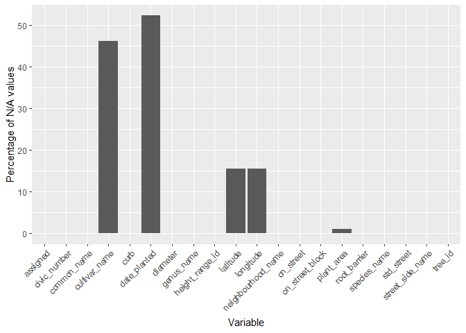
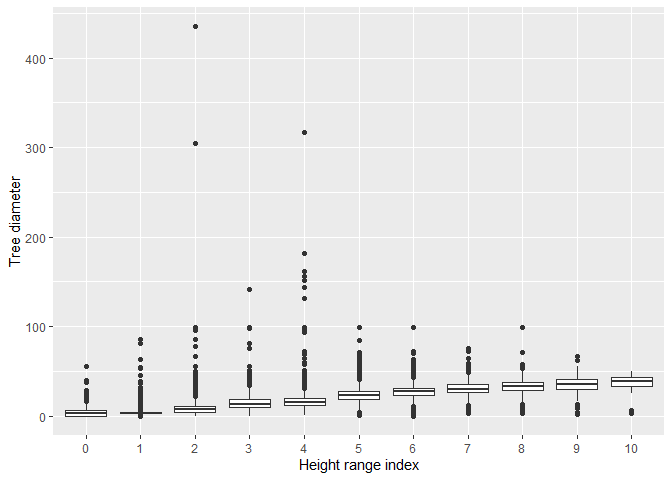
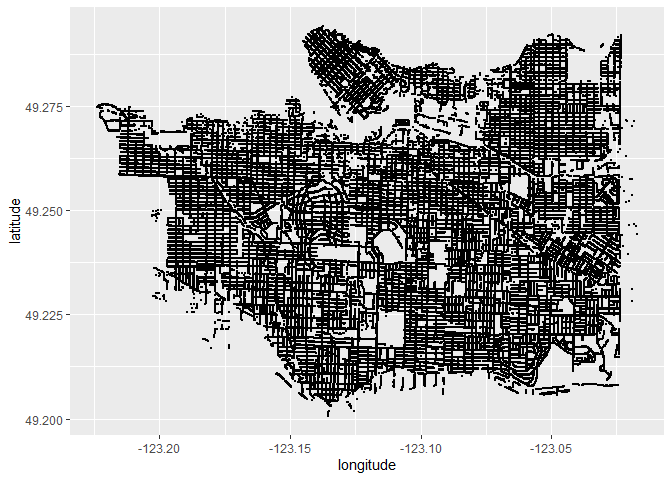
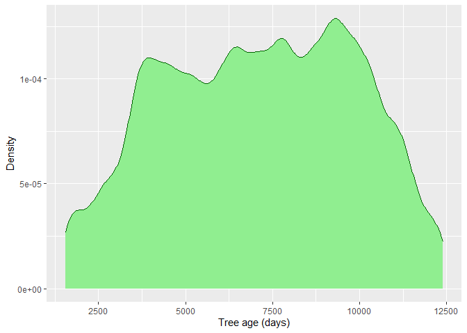

Mini Data-Analysis Deliverable 1
================

# Welcome to your (maybe) first-ever data analysis project!

And hopefully the first of many. Let’s get started:

1.  Install the [`datateachr`](https://github.com/UBC-MDS/datateachr)
    package by typing the following into your **R terminal**:

<!-- -->

    install.packages("devtools")
    devtools::install_github("UBC-MDS/datateachr")

2.  Load the packages below.

``` r
library(datateachr)
library(tidyverse)
```

    ## ── Attaching core tidyverse packages ──────────────────────── tidyverse 2.0.0 ──
    ## ✔ dplyr     1.1.3     ✔ readr     2.1.4
    ## ✔ forcats   1.0.0     ✔ stringr   1.5.0
    ## ✔ ggplot2   3.4.3     ✔ tibble    3.2.1
    ## ✔ lubridate 1.9.2     ✔ tidyr     1.3.0
    ## ✔ purrr     1.0.2     
    ## ── Conflicts ────────────────────────────────────────── tidyverse_conflicts() ──
    ## ✖ dplyr::filter() masks stats::filter()
    ## ✖ dplyr::lag()    masks stats::lag()
    ## ℹ Use the conflicted package (<http://conflicted.r-lib.org/>) to force all conflicts to become errors

3.  Make a repository in the <https://github.com/stat545ubc-2023>
    Organization. You can do this by following the steps found on canvas
    in the entry called [MDA: Create a
    repository](https://canvas.ubc.ca/courses/126199/pages/mda-create-a-repository).
    One completed, your repository should automatically be listed as
    part of the stat545ubc-2023 Organization.

# Instructions

## For Both Milestones

-   Each milestone has explicit tasks. Tasks that are more challenging
    will often be allocated more points.

-   Each milestone will be also graded for reproducibility, cleanliness,
    and coherence of the overall Github submission.

-   While the two milestones will be submitted as independent
    deliverables, the analysis itself is a continuum - think of it as
    two chapters to a story. Each chapter, or in this case, portion of
    your analysis, should be easily followed through by someone
    unfamiliar with the content.
    [Here](https://swcarpentry.github.io/r-novice-inflammation/06-best-practices-R/)
    is a good resource for what constitutes “good code”. Learning good
    coding practices early in your career will save you hassle later on!

-   The milestones will be equally weighted.

## For Milestone 1

**To complete this milestone**, edit [this very `.Rmd`
file](https://raw.githubusercontent.com/UBC-STAT/stat545.stat.ubc.ca/master/content/mini-project/mini-project-1.Rmd)
directly. Fill in the sections that are tagged with
`<!--- start your work below --->`.

**To submit this milestone**, make sure to knit this `.Rmd` file to an
`.md` file by changing the YAML output settings from
`output: html_document` to `output: github_document`. Commit and push
all of your work to the mini-analysis GitHub repository you made
earlier, and tag a release on GitHub. Then, submit a link to your tagged
release on canvas.

**Points**: This milestone is worth 36 points: 30 for your analysis, and
6 for overall reproducibility, cleanliness, and coherence of the Github
submission.

# Learning Objectives

By the end of this milestone, you should:

-   Become familiar with your dataset of choosing
-   Select 4 questions that you would like to answer with your data
-   Generate a reproducible and clear report using R Markdown
-   Become familiar with manipulating and summarizing your data in
    tibbles using `dplyr`, with a research question in mind.

# Task 1: Choose your favorite dataset

The `datateachr` package by Hayley Boyce and Jordan Bourak currently
composed of 7 semi-tidy datasets for educational purposes. Here is a
brief description of each dataset:

-   *apt_buildings*: Acquired courtesy of The City of Toronto’s Open
    Data Portal. It currently has 3455 rows and 37 columns.

-   *building_permits*: Acquired courtesy of The City of Vancouver’s
    Open Data Portal. It currently has 20680 rows and 14 columns.

-   *cancer_sample*: Acquired courtesy of UCI Machine Learning
    Repository. It currently has 569 rows and 32 columns.

-   *flow_sample*: Acquired courtesy of The Government of Canada’s
    Historical Hydrometric Database. It currently has 218 rows and 7
    columns.

-   *parking_meters*: Acquired courtesy of The City of Vancouver’s Open
    Data Portal. It currently has 10032 rows and 22 columns.

-   *steam_games*: Acquired courtesy of Kaggle. It currently has 40833
    rows and 21 columns.

-   *vancouver_trees*: Acquired courtesy of The City of Vancouver’s Open
    Data Portal. It currently has 146611 rows and 20 columns.

**Things to keep in mind**

-   We hope that this project will serve as practice for carrying our
    your own *independent* data analysis. Remember to comment your code,
    be explicit about what you are doing, and write notes in this
    markdown document when you feel that context is required. As you
    advance in the project, prompts and hints to do this will be
    diminished - it’ll be up to you!

-   Before choosing a dataset, you should always keep in mind **your
    goal**, or in other ways, *what you wish to achieve with this data*.
    This mini data-analysis project focuses on *data wrangling*,
    *tidying*, and *visualization*. In short, it’s a way for you to get
    your feet wet with exploring data on your own.

And that is exactly the first thing that you will do!

1.1 **(1 point)** Out of the 7 datasets available in the `datateachr`
package, choose **4** that appeal to you based on their description.
Write your choices below:

**Note**: We encourage you to use the ones in the `datateachr` package,
but if you have a dataset that you’d really like to use, you can include
it here. But, please check with a member of the teaching team to see
whether the dataset is of appropriate complexity. Also, include a
**brief** description of the dataset here to help the teaching team
understand your data.

<!-------------------------- Start your work below ---------------------------->

1: *cancer_sample* 2: *flow_sample* 3: *steam_games* 4:
*vancouver_trees*

<!----------------------------------------------------------------------------->

1.2 **(6 points)** One way to narrowing down your selection is to
*explore* the datasets. Use your knowledge of dplyr to find out at least
*3* attributes about each of these datasets (an attribute is something
such as number of rows, variables, class type…). The goal here is to
have an idea of *what the data looks like*.

*Hint:* This is one of those times when you should think about the
cleanliness of your analysis. I added a single code chunk for you below,
but do you want to use more than one? Would you like to write more
comments outside of the code chunk?

<!-------------------------- Start your work below ---------------------------->

First, I will define a simple function to print out some info on a
dataset

``` r
summarize_dataset <- function(set, name){
  cat("############", name,"############", "\n\n\n")
  cat("Dataset shape (rows columns): ", dim(set), "\n\n")
  cat("Column names:                 ", colnames(set), "\n\n")
  classes = lapply(set, class)
  cat("Data types:                   ",unlist(classes) , "\n\n")
  cat("\n\n")
}
```

Now, I will call my function on the four datasets I’m interested in

``` r
data_sets <- list()
summarize_dataset(cancer_sample, "Cancer")
```

    ## ############ Cancer ############ 
    ## 
    ## 
    ## Dataset shape (rows columns):  569 32 
    ## 
    ## Column names:                  ID diagnosis radius_mean texture_mean perimeter_mean area_mean smoothness_mean compactness_mean concavity_mean concave_points_mean symmetry_mean fractal_dimension_mean radius_se texture_se perimeter_se area_se smoothness_se compactness_se concavity_se concave_points_se symmetry_se fractal_dimension_se radius_worst texture_worst perimeter_worst area_worst smoothness_worst compactness_worst concavity_worst concave_points_worst symmetry_worst fractal_dimension_worst 
    ## 
    ## Data types:                    numeric character numeric numeric numeric numeric numeric numeric numeric numeric numeric numeric numeric numeric numeric numeric numeric numeric numeric numeric numeric numeric numeric numeric numeric numeric numeric numeric numeric numeric numeric numeric

``` r
summarize_dataset(flow_sample, "Flow")
```

    ## ############ Flow ############ 
    ## 
    ## 
    ## Dataset shape (rows columns):  218 7 
    ## 
    ## Column names:                  station_id year extreme_type month day flow sym 
    ## 
    ## Data types:                    character numeric character numeric numeric numeric character

``` r
summarize_dataset(steam_games, "Games")
```

    ## ############ Games ############ 
    ## 
    ## 
    ## Dataset shape (rows columns):  40833 21 
    ## 
    ## Column names:                  id url types name desc_snippet recent_reviews all_reviews release_date developer publisher popular_tags game_details languages achievements genre game_description mature_content minimum_requirements recommended_requirements original_price discount_price 
    ## 
    ## Data types:                    numeric character character character character character character character character character character character character numeric character character character character character numeric numeric

``` r
summarize_dataset(vancouver_trees, "Trees")
```

    ## ############ Trees ############ 
    ## 
    ## 
    ## Dataset shape (rows columns):  146611 20 
    ## 
    ## Column names:                  tree_id civic_number std_street genus_name species_name cultivar_name common_name assigned root_barrier plant_area on_street_block on_street neighbourhood_name street_side_name height_range_id diameter curb date_planted longitude latitude 
    ## 
    ## Data types:                    numeric numeric character character character character character character character character numeric character character character numeric numeric character Date numeric numeric

<!----------------------------------------------------------------------------->

1.3 **(1 point)** Now that you’ve explored the 4 datasets that you were
initially most interested in, let’s narrow it down to 1. What lead you
to choose this one? Briefly explain your choice below.

<!-------------------------- Start your work below ---------------------------->

Looking at this information, I’d like to study the vancouver trees
dataset. It has many observations, which should allow for robust data
analysis, an has a good set of quantitative properties that seeem like
they could have some interesting relations.

<!----------------------------------------------------------------------------->

1.4 **(2 points)** Time for a final decision! Going back to the
beginning, it’s important to have an *end goal* in mind. For example, if
I had chosen the `titanic` dataset for my project, I might’ve wanted to
explore the relationship between survival and other variables. Try to
think of 1 research question that you would want to answer with your
dataset. Note it down below.

<!-------------------------- Start your work below ---------------------------->

I’d like to explore how different types of tree grow over time. That is
to say, how is the diameter of the tree affected by the date_planted?

<!----------------------------------------------------------------------------->

# Important note

Read Tasks 2 and 3 *fully* before starting to complete either of them.
Probably also a good point to grab a coffee to get ready for the fun
part!

This project is semi-guided, but meant to be *independent*. For this
reason, you will complete tasks 2 and 3 below (under the **START HERE**
mark) as if you were writing your own exploratory data analysis report,
and this guidance never existed! Feel free to add a brief introduction
section to your project, format the document with markdown syntax as you
deem appropriate, and structure the analysis as you deem appropriate. If
you feel lost, you can find a sample data analysis
[here](https://www.kaggle.com/headsortails/tidy-titarnic) to have a
better idea. However, bear in mind that it is **just an example** and
you will not be required to have that level of complexity in your
project.

# Task 2: Exploring your dataset

If we rewind and go back to the learning objectives, you’ll see that by
the end of this deliverable, you should have formulated *4* research
questions about your data that you may want to answer during your
project. However, it may be handy to do some more exploration on your
dataset of choice before creating these questions - by looking at the
data, you may get more ideas. **Before you start this task, read all
instructions carefully until you reach START HERE under Task 3**.

2.1 **(12 points)** Complete *4 out of the following 8 exercises* to
dive deeper into your data. All datasets are different and therefore,
not all of these tasks may make sense for your data - which is why you
should only answer *4*.

Make sure that you’re using dplyr and ggplot2 rather than base R for
this task. Outside of this project, you may find that you prefer using
base R functions for certain tasks, and that’s just fine! But part of
this project is for you to practice the tools we learned in class, which
is dplyr and ggplot2.

1.  Plot the distribution of a numeric variable.
2.  Create a new variable based on other variables in your data (only if
    it makes sense)
3.  Investigate how many missing values there are per variable. Can you
    find a way to plot this?
4.  Explore the relationship between 2 variables in a plot.
5.  Filter observations in your data according to your own criteria.
    Think of what you’d like to explore - again, if this was the
    `titanic` dataset, I may want to narrow my search down to passengers
    born in a particular year…
6.  Use a boxplot to look at the frequency of different observations
    within a single variable. You can do this for more than one variable
    if you wish!
7.  Make a new tibble with a subset of your data, with variables and
    observations that you are interested in exploring.
8.  Use a density plot to explore any of your variables (that are
    suitable for this type of plot).

2.2 **(4 points)** For each of the 4 exercises that you complete,
provide a *brief explanation* of why you chose that exercise in relation
to your data (in other words, why does it make sense to do that?), and
sufficient comments for a reader to understand your reasoning and code.

<!-------------------------- Start your work below ---------------------------->
<!----------------------------------------------------------------------------->

# Vancouver Trees: A Short data-driven exploration

## Introduction

Urban ecology is a fascinating field of study describing the biological
interactions that exist in the urban environment. In this report, I will
use dplyr and ggplot to explore the growth of trees in Vancouver,
Canada, using the `vancouver_trees` dataset from the `datateachr`
package. This dataset, provided by the City of Vancouver’s open data
portal lists 20 properties of 146,611 trees in the greater Vancouver
area.

## Part 1: Data quality

The first thing I’d like to check is how complete the data is, to ensure
I am using high-quality properties and to avoid any bias in my analysis.
I will do this by plotting the count of `N/A` values for each variable.

``` r
# For each column, count the number of na, and divide by the total length
pct_na <- vancouver_trees %>%
  summarise_all(function(x) sum(is.na(x))/length(x)*100) %>%
  pivot_longer(everything(), names_to = "Variable", values_to = "Percent_NA")

# Print in table form
print(pct_na)
```

    ## # A tibble: 20 × 2
    ##    Variable           Percent_NA
    ##    <chr>                   <dbl>
    ##  1 tree_id                  0   
    ##  2 civic_number             0   
    ##  3 std_street               0   
    ##  4 genus_name               0   
    ##  5 species_name             0   
    ##  6 cultivar_name           46.1 
    ##  7 common_name              0   
    ##  8 assigned                 0   
    ##  9 root_barrier             0   
    ## 10 plant_area               1.01
    ## 11 on_street_block          0   
    ## 12 on_street                0   
    ## 13 neighbourhood_name       0   
    ## 14 street_side_name         0   
    ## 15 height_range_id          0   
    ## 16 diameter                 0   
    ## 17 curb                     0   
    ## 18 date_planted            52.2 
    ## 19 longitude               15.5 
    ## 20 latitude                15.5

``` r
# Plot it as a bar chart
pct_na %>% ggplot(aes(x = Variable, y = Percent_NA)) + 
geom_bar(stat = "identity") +
ylab("Percentage of N/A values") +
theme(axis.text.x = element_text(angle = 45, vjust = 1, hjust = 1))
```

<!-- -->

As we can see, most variables are complete, although over half are
missing the date planted, and over 15% are missing the latitude and
longitude. Over 45% are also missing the cultivar name, and a few are
missing the plant area, but these were not particularly revealing
variables anyways.

## Part 2: Height and width of trees

I see that the trees don’t have a measured height, but do have a value
called `height_range_id`. To get to understand what this might mean,
I’ll plot it against diameter, with the expectation that height and
diameter are roughly proportional.

``` r
vancouver_trees %>%
  ggplot(aes(x = factor(height_range_id), y = diameter)) +
  geom_boxplot() +
  xlab("Height range index") +
  ylab("Tree diameter")
```

<!-- -->

As expected, it seems like the median diameter tends to increase with
the height range, however there are some remarkably wide trees with a
relatively low height index. I wonder if this isn’t an error in the
data, but it could also simply be due to different species of trees
having radically different shapes.

Based on this information, I think it’s best to use diameter as an
indicator of size, being more precise. It may be worth considering some
combination of both in the future though

## Part 3:Where are the trees?

One other basic thing I’d like to know is just where these trees are
located in Vancouver. I’m hoping that by plotting lattitude against
longitude, I’ll get a recognizable map of Vancouver, even though we’re
missing some values

``` r
#This code is a little slow due to the number of points here
vancouver_trees %>%
  ggplot(aes(x = longitude, y = latitude)) +
  geom_point(size = 0.2)
```

    ## Warning: Removed 22771 rows containing missing values (`geom_point()`).

<!-- -->

Sure enough, this is a map of vancouver, we can clearly see downtown up
top, and the shoreline of the Fraser river at the bottom. Notably, this
dataset seems to be only urban vancouver. The data does not include
Pacfic Spirit Park on the west side or Stanley park up north, (which
would presumably have very different tree populations than in more urban
areas), or various other parks which appear as holes in the data. There
are also a few points which appear to be easy of the cutoff for most
other trees. I’m not sure how to explain this, maybe these are a few
trees in Burnaby that Vancovuer somehow has ownership over, or maybe
this is due to errors in data entry.

## Part 4: How old are the trees

### 4a: Converting date planted to age

While we could just use the “date planted” column directly, I think it
will be nicer to have a column for age directly. Let’s compute this
using R’s built in “date” data type

``` r
trees_with_age <- vancouver_trees %>% 
  mutate(age = as.Date("2023-10-05") - as.Date(date_planted))
print(head(trees_with_age$age))
```

    ## Time differences in days
    ## [1]  9031  9988 10909 10020 10884    NA

### 4b: The age distribution

Now, to learn how old these trees are, let’s try a density plot, since
this is an effectively continuous variable with a large range.

``` r
trees_with_age %>% ggplot(aes(x = age)) +
  geom_density(color = "darkgreen", fill = "lightgreen") +
  xlab("Tree age (days)") +
  ylab("Density")
```

    ## Don't know how to automatically pick scale for object of type <difftime>.
    ## Defaulting to continuous.

    ## Warning: Removed 76548 rows containing non-finite values (`stat_density()`).

<!-- -->

We can see a very nice range of ages here, tailing off on the high end
as trees got too old to live or to have a known planting date, and on
the yound end as well, potentially as vancouver stopped adding new
neighbourhoods that needed trees. Of course, it’s important to note that
we don’t actually have the time that these measurements were taken. This
is these tree’s ages as of writing this report, but of course their
diameters and heights are certainly different by now. It’s also unclear
over what timeframe this data was collected - was it one short
initiative to catalogue all the trees, or has this data been collected
over many years? # Task 3: Choose research questions

**(4 points)** So far, you have chosen a dataset and gotten familiar
with it through exploring the data. You have also brainstormed one
research question that interested you (Task 1.4). Now it’s time to pick
4 research questions that you would like to explore in Milestone 2!
Write the 4 questions and any additional comments below.

<!--- *****START HERE***** --->

1.  How is tree diameter affected by the date planted?
2.  How does the road side affect tree growth (this is in
    `street_side_name`)?
3.  How is tree growth affected by distance to the coast?
4.  Given the above factors, which tree species grows the largest?

<!----------------------------->

# Overall reproducibility/Cleanliness/Coherence Checklist

## Coherence (0.5 points)

The document should read sensibly from top to bottom, with no major
continuity errors. An example of a major continuity error is having a
data set listed for Task 3 that is not part of one of the data sets
listed in Task 1.

## Error-free code (3 points)

For full marks, all code in the document should run without error. 1
point deduction if most code runs without error, and 2 points deduction
if more than 50% of the code throws an error.

## Main README (1 point)

There should be a file named `README.md` at the top level of your
repository. Its contents should automatically appear when you visit the
repository on GitHub.

Minimum contents of the README file:

-   In a sentence or two, explains what this repository is, so that
    future-you or someone else stumbling on your repository can be
    oriented to the repository.
-   In a sentence or two (or more??), briefly explains how to engage
    with the repository. You can assume the person reading knows the
    material from STAT 545A. Basically, if a visitor to your repository
    wants to explore your project, what should they know?

Once you get in the habit of making README files, and seeing more README
files in other projects, you’ll wonder how you ever got by without them!
They are tremendously helpful.

## Output (1 point)

All output is readable, recent and relevant:

-   All Rmd files have been `knit`ted to their output md files.
-   All knitted md files are viewable without errors on Github. Examples
    of errors: Missing plots, “Sorry about that, but we can’t show files
    that are this big right now” messages, error messages from broken R
    code
-   All of these output files are up-to-date – that is, they haven’t
    fallen behind after the source (Rmd) files have been updated.
-   There should be no relic output files. For example, if you were
    knitting an Rmd to html, but then changed the output to be only a
    markdown file, then the html file is a relic and should be deleted.

(0.5 point deduction if any of the above criteria are not met. 1 point
deduction if most or all of the above criteria are not met.)

Our recommendation: right before submission, delete all output files,
and re-knit each milestone’s Rmd file, so that everything is up to date
and relevant. Then, after your final commit and push to Github, CHECK on
Github to make sure that everything looks the way you intended!

## Tagged release (0.5 points)

You’ve tagged a release for Milestone 1.

### Attribution

Thanks to Icíar Fernández Boyano for mostly putting this together, and
Vincenzo Coia for launching.
